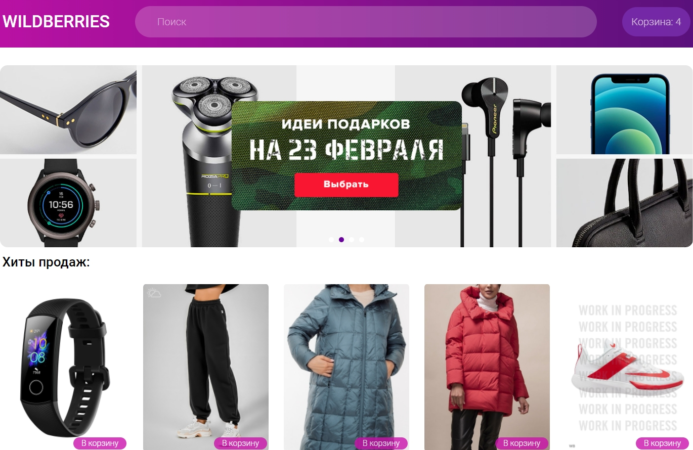
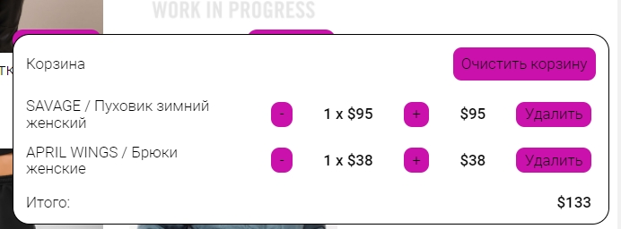
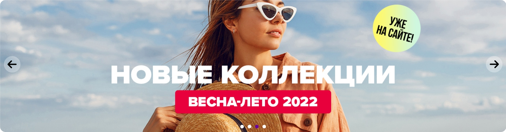
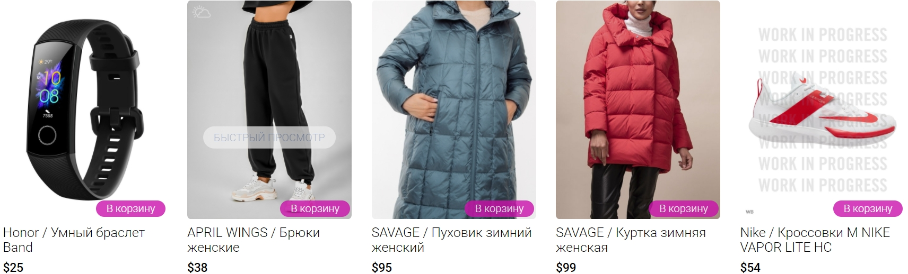
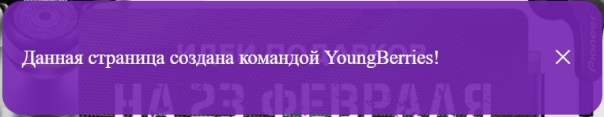

<div id="top"></div>

  <h1 align="center">WILDBERRIES</h1>

  <ol>
    <li>
      <a href="#About-the-project">About the project</a>
    </li>
    <li><a href="#Installing-and-running-the-project">Installing and running the project</a></li>
    <li>
        <a href="#Project-elements">Project elements</a>
        <ul>
            <li><a href="#Header">Header</a></li>
            <li><a href="#Slider">Slider</a></li>
            <li><a href="#Product-cards">Product cards</a></li>
            <li><a href="#Quick-view-window">Quick view window</a></li>
            <li><a href="#Toast">Toast</a></li>
        </ul>
    </li>
    <li><a href="#Our team">Our-team</a></li>
    <li><a href="#acknowledgment">Acknowledgment</a></li>
    
  </ol>

## About the project

The "youngBerries" project is a simplified version of the well-known international online store WILDBERRIES.

[]()

<p align="right">(<a href="#top">back to top</a>)</p>

### Installing and running the project

You need to do the following:

1. Copy repository
   ```sh
   git clone https://github.com/Tsygan-Aleksey/youngBerries.git
   ```
2. Install Node modules
   ```sh
   npm install
   ```
3. Build and run project
   ```sh
   npm run dev
   ```
   <p align="right">(<a href="#top">back to top</a>)</p>

# Project elements

## Header

[]()

1. Website logo.
2. You can easily find the right product using the search. The search is implemented by entering the first character in the field, after which the picking of the product immediately begins.
3. Cart is a button for opening a modal window with products that you choose for yourself and may want to buy.

   []()

   Modal window with products:

   - The name of the product, its price, quantity and total amount of all goods are displayed here.
   - Buttons for increasing and decreasing the number of products, in addition, you can delete a particular product, or clear the cart completely.
   - The data in the cart will remain unchanged after reloading the site, so you can return to the order at any time.

## Slider

[]()

Buttons for switching between slides are located on the left and right. At the bottom of the slider in the center there are buttons in the form of dots for quick switching to the slide you are interested in.

## Product cards

Under the slider there is a section "Sales hits", in which the goods are located.

[]()

- Each product card has a name, price and image.
- There is a "Add to cart" button on the card for quickly adding an item to the cart.
- For more detailed information about the product, you can hover over the card and click the "Quick view" button, a modal window with more detailed information will open.

## Quick view window

[]()

The quick view window is an enlarged product card with information on it. In the future, more detailed information about the product will appear in this window.

## Toast

[]()

A toast is also implemented in the project. A toast is an unobtrusive notification that mimics push notifications. In the project, the toast carries information about who created the site. The toast notification appears fifteen seconds after the site loads.

In our project we used:

- scss
- javascript
- parcel-bundler
  - parcel-plugin-static-files-copy

<p align="right">(<a href="#top">back to top</a>)</p>

## Our team

- Aleksey - [@linkedIn](https://www.linkedin.com/in/aleksey-tsygan-978a6a228/) - newrety1996@gmail.com
- Alexander [Zhibul-Alexander](https://github.com/Zhibul-Alexander) - alexanderzhibul@mail.ru
- Kirill [Kirill-Bukin](https://github.com/Kirill-Bukin)
- Kate [Kate-Levchuk](https://github.com/Kate-Levchuk)

Project link: [https://github.com/Tsygan-Aleksey/youngBerries](https://github.com/Tsygan-Aleksey/youngBerries)

<p align="right">(<a href="#top">back to top</a>)</p>

# Acknowledgment

Special thanks to our teacher for the incredible help in creating the project.

Oleg - [Oleg-Kolosov](https://github.com/Oleg-Kolosov)

<p align="right">(<a href="#top">back to top</a>)</p>
