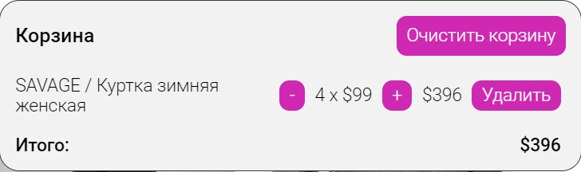
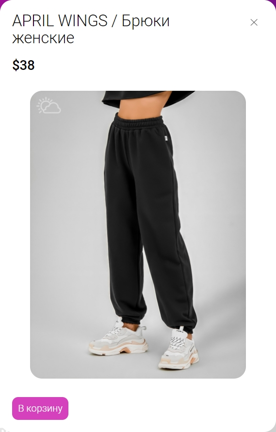

<div id="top"></div>

  <h1 align="center">WILDBERRIES</h1>

  <ol>
    <li>
      <a href="#About-the-project"># About the project</a>
    </li>
    <li><a href="#Installing-and-running-the-project">Installing and running the project</a></li>
    <li>
        <a href="#Project-elements">Project elements</a>
        <ul>
            <li><a href="#Header">Header</a></li>
            <li><a href="#Slider">Slider</a></li>
            <li><a href="#Product-cards">Product cards</a></li>
            <li><a href="#Quick-view-window">Quick view window</a></li>
            <li><a href="#Toast">Toast</a></li>
        </ul>
    </li>
    <li><a href="#Our team">Our-team</a></li>
    <li><a href="#acknowledgment">Acknowledgment</a></li>
    
  </ol>


## About the project
The "YoungWildberries" project is a simplified version of the well-known international online store WILDBERRIES.

[]()

<p align="right">(<a href="#top">back to top</a>)</p>

### Installing and running the project

You need to do the following:

1. Copy repository
   ```sh
   git clone https://github.com/Tsygan-Aleksey/youngBerries.git
   ```
2. Install Node modules
   ```sh
   npm install
   ```
3. Build and run project
   ```sh
   npm run dev
   ```
   <p align="right">(<a href="#top">back to top</a>)</p>

# Project elements

## Header

[]()

1. Site logo.
2. Search - with which you can easily find the right product. It is implemented in such a way that when you enter the first character, it immediately starts picking up the product.
3. Cart is a button to open a modal window with products that you choose for yourself and may want to buy.

    []()

   Modal window with products:

   - It displays the name of the product, its price, quantity and total amount of all products.
   - Buttons to increase and decrease the number of products, in addition, you can delete this or that product, or empty the basket completely.
   - After reloading the site, the data in the basket will remain unchanged, this will allow you to return to the order at any time.

## Slider

[]()

There are buttons on the left and right to switch between slides. At the bottom of the slider in the center there are buttons in the form of dots to quickly switch to the slide you are interested in.

## Product cards

Below the slider is the "Bestsellers" section, which contains products.

[]() 

- Each product card has a name, price and image
- On the card there is a button "Add to cart" to quickly add goods to the cart
- For more detailed information about the product, you can hover over the card and click the "quick view" button, a modal window will open with more detailed information.

## Quick view window

[]()

The quick view window is an enlarged product card with information about it. More product information will be available in the near future.

## Toast

[]()

A toast was also implemented on the project. Toast is a non-intrusive notification that mimics push notifications. In the project, the toast carries information about who created the site. It appears 15 seconds after the site loads.

In our project we used:

- scss
- javascript
- parcel-bundler
   * parcel-plugin-static-files-copy
   
<p align="right">(<a href="#top">back to top</a>)</p>

## Our team

- Aleksey - [@linkedIn](https://www.linkedin.com/in/aleksey-tsygan-978a6a228/) - newrety1996@gmail.com
- Alexander [Zhibul-Alexander](https://github.com/Zhibul-Alexander) - alexanderzhibul@mail.ru
- Kirill [Kirill-Bukin](https://github.com/Kirill-Bukin)
- Kate [Kate-Levchuk](https://github.com/Kate-Levchuk)

Project link: [https://github.com/Tsygan-Aleksey/youngBerries](https://github.com/Tsygan-Aleksey/youngBerries)

<p align="right">(<a href="#top">back to top</a>)</p>

# Acknowledgment

Special thanks to our teacher for the incredible help in creating the project.

Oleg - [Oleg-Kolosov](https://github.com/Oleg-Kolosov)

<p align="right">(<a href="#top">back to top</a>)</p>
